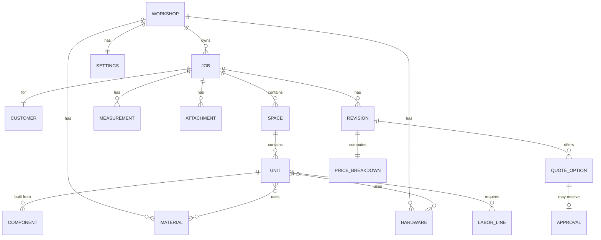
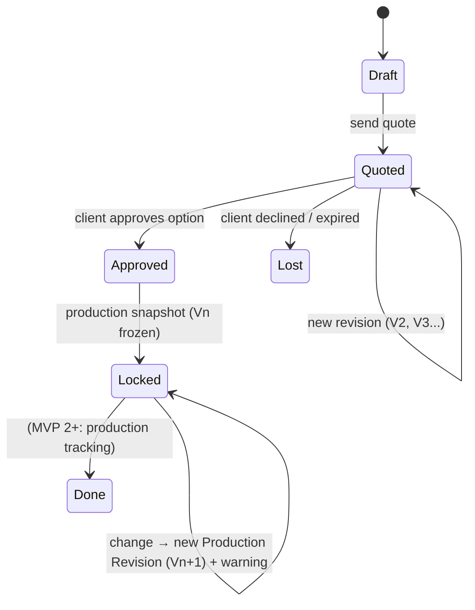

# Quote-to-Build OS — PRD v0.1

**סטטוס:** טיוטה לדיון · **תאריך:** 2026-09-26 · **בעלים:** Liel Krispin
**מקור:** Product Brief "Quote-to-Build OS for Custom Carpentry" (76 סעיפים)
**מקרה עיגון (design partner):** סטודיו אבי קריספין — נגרות בהתאמה אישית ושדרוג ריהוט, צפון הארץ

> סימון: `°` = הנחה/היסק שלי ולא עובדה. חייב ולידציה מול אבי או נגרייה אחרת לפני שמסתמכים עליו.

---

## 0. TL;DR

**מה בונים:** מערכת שמייצגת כל עבודת נגרות כ־Job אחד, ושבה שינוי בתכנון (מידה, חומר, מבנה) מתעדכן אוטומטית במחיר, בכמויות ובשולי הרווח.

**ה־wedge:** Quote → Approval. לא CRM, לא CAD, לא ERP. MVP 1 נגמר ברגע שהלקוח לוחץ Approve והמערכת נועלת גרסת ייצור.

**המבחן של ה־MVP (Killer Moment):** נגר משנה רוחב ארון מ־2400 ל־2700 ורואה בתוך שנייה: מחיר חדש, +1 לוח, +3 צירים, margin חדש. אם המסך הזה לא מרגיש קסם — המוצר לא עובד, ולא משנה כמה פיצ'רים יש מסביב.

**מה ירד (80%):** BOM, cut list, sheet optimization, offcuts, procurement, PO, production board, worker mode, installer mode, issues, rework cost, actual vs estimated, AI copilot, voice, WhatsApp integration, search חכם, dashboard, BI, permissions, integrations, marketplace. כולם נשארים ב־roadmap; אף אחד לא במסכי MVP 1.

**מה נשאר:** 11 מסכים. Jobs · Job Overview · Intake Draft · Measurements (mobile) · Unit Builder · Pricing · Materials & Hardware Library · Quote Builder · Revisions & Impact · Client Portal · Workshop Settings.

**התובנה החשובה ביותר מהעיגון על אבי:** הבריף מניח שכל יחידה היא "ארון פרמטרי". הסטודיו של אבי עושה גם שדרוג ריהוט קיים וגם חיפויי קיר. שני אלה **לא** מתפרקים ל־modules. לכן מודל ה־Unit חייב לתמוך משלב אפס בשלושה סוגים: **Parametric** (ארון/מטבח), **Area-based** (חיפוי, לפי מ"ר), **Free-form** (שיקום, לפי שעות + חומרים). בלי זה, ה־MVP לא מכסה אפילו את מקרה העיגון שלנו.

**מה צריך לאמת לפני קוד:** 3 השערות בסעיף 11. החזקה ביותר: "נגריות לא יודעות בזמן אמת כמה Job באמת עולה להן." אם זה לא נכון — ה־Pricing Engine הוא nice-to-have ולא הליבה.

---

## 1. Framing

### 1.1 Thesis

**One Job. One Source of Truth.**
המוצר הוא compiler בין Design ל־Commercial: הנגר מגדיר את המוצר פעם אחת, והמערכת גוזרת ממנו מחיר, כמויות ורווחיות. כל שינוי מתפשט קדימה.

### 1.2 Positioning

> From customer idea to workshop-ready job.
> Quote it. Build it. Know your margin.

**לא:** CRM טוב יותר · CAD קל יותר · "AI לנגרים".

### 1.3 Product Promise (המסננת לכל פיצ'ר)

1. Know what to charge.
2. Know what to build.
3. Know what you actually earned.

MVP 1 מקיים את (1) במלואו, את (2) חלקית (הגדרת המוצר, בלי BOM/cut list), ואת (3) בכלל לא. זה מכוון.

### 1.4 מה ה־MVP צריך להוכיח

| שאלה | איך נדע |
|---|---|
| האם נגר מוכן להגדיר Job במודל מובנה במקום WhatsApp + Excel? | 5 עבודות אמיתיות שהוזנו במערכת מתחילתן ועד הצעת מחיר, בלי שהנגר "ברח" לאקסל |
| האם ה־Pricing Engine נותן מחיר שהנגר סומך עליו? | הפרש בין המחיר שהמערכת מציעה למחיר שהנגר היה נותן ידנית < 10% ב־4 מתוך 5 עבודות° |
| האם Change Impact הוא באמת ה־killer moment? | הנגר משתמש ב־Revisions מיוזמתו כשהלקוח מבקש שינוי, במקום להתחיל הצעה חדשה |
| האם זמן ההצעה יורד? | מ־~2 שעות ל־<30 דקות° (הבסיס "2 שעות" הוא מהבריף, לא נמדד) |

---

## 2. מקרה העיגון: סטודיו אבי קריספין

### 2.1 מה ידוע (מהאתר)

- סטודיו אישי, מעל 30 שנות ניסיון, צפון הארץ.
- ארבעה קווי שירות: **ריהוט בהתאמה אישית**, **שדרוג ושיקום ריהוט**, **חיפויי קיר ופאנלים אקוסטיים**, **קונסולות ופריטי מפתח**.
- הפנייה הראשונית מהאתר היא כפתור WhatsApp.

### 2.2 מה אני מניח (° — לאמת בשיחה עם אבי)

- ° עובד לבד או עם עוזר אחד. אין Estimator, Designer, Workshop Manager או Installer נפרדים. **כל הפרסונות המשניות בבריף הן אותו אדם.**
- ° התמחור היום נעשה מהניסיון ("אני יודע כמה זה"), לא מנוסחה. יכול להיות שהמערכת תיתפס כאיטית יותר מהראש שלו בהתחלה.
- ° אין CNC. חיתוך ידני/מסור שולחן. משמעות: cut list פחות קריטי ל־wedge שלו, sheet optimization בכלל לא.
- ° אין ניהול מלאי. שאריות לוחות קיימות פיזית אבל לא רשומות.
- ° ההצעות היום נשלחות כטקסט בוואטסאפ או PDF פשוט. לא ברור אם יש payment schedule פורמלי.
- ° חלק משמעותי מהעבודות (שיקום, קונסולות) הן חד־פעמיות ולא מודולריות. אין "template" שחוזר.
- ° לקוחות פרטיים בעיקר, לא קבלנים/אדריכלים. פחות תוכניות אדריכליות, יותר תמונות השראה.

### 2.3 מה זה משנה ב־PRD

| הנחת הבריף | המציאות אצל אבי | השלכה על MVP |
|---|---|---|
| Unit = ארון פרמטרי | 2 מתוך 4 קווי שירות אינם פרמטריים | 3 סוגי Unit (ראה 4.2) |
| 5 פרסונות | פרסונה אחת | אין permissions, אין worker/installer mode |
| 2–20 עובדים | 1–2 | Labor הוא שעות של הבעלים; Overhead פשוט (סכום חודשי ÷ שעות) |
| Material Library מלאה | ° אין ספרייה | Onboarding עם 10–15 presets ישראליים (Egger, Kronospan, בלום) ולא טופס ריק |
| WhatsApp intake דרך integration | WhatsApp ידני | Intake = paste טקסט + העלאת תמונות. AI parsing נדחה |
| Installer mode | אבי מתקין בעצמו | Installation = שדה תמחור + תאריך ב־Job, לא מודול |

**סיכון עיגון:** אבי הוא נגרייה קטנה מהפרסונה הראשית בבריף. מה שנלמד ממנו תקף ל־Pricing ול־Revisions, **פחות** תקף ל־Production/Workshop. צריך לפחות נגרייה אחת נוספת בגודל 5–10 עובדים לוולידציה של MVP 2+.

---

## 3. Persona ל־MVP 1

**Owner-Operator.** אדם אחד שהוא המוכר, המודד, המתמחר, המתכנן והמייצר.

**מה הוא רוצה:** "לא לזכור יותר מדי דברים" ולדעת מהר מה לגבות.
**מה הוא לא רוצה:** ללמוד תוכנה, להזין ספרייה לפני שראה ערך, למלא טפסים בשטח.
**מכשיר:** נייד בשטח (מדידות, תמונות), מחשב בערב (תמחור, הצעה). ° לאמת אם בכלל יש מחשב בשגרה או שהכול נייד.

Personas שנדחו ל־MVP 2+: Estimator, Designer, Workshop Manager, Installer, Accountant.

---

## 4. Data Model

### 4.1 ישויות



### 4.2 Unit — שלושה סוגים

זו ההחלטה המבנית החשובה ביותר ב־PRD. בלי זה המוצר לא מכסה את מקרה העיגון.

| סוג | דוגמה | איך מתומחר | מה מחשבים אוטומטית |
|---|---|---|---|
| **Parametric** | ארון, מטבח, מזנון, ספרייה | W×H×D + מבנה (bays, מדפים, מגירות, דלתות) → כמויות | לוחות (שטח + waste), קנטים (מ"א), פרזול (לפי כללים: 3 צירים/דלת), שעות (לפי component) |
| **Area-based** | חיפוי קיר, פאנל אקוסטי, גב מיטה | מ"ר × מחיר חומר למ"ר + שעות למ"ר + חומרי עזר | שטח, waste, זמן הרכבה |
| **Free-form** | שיקום שידה, קונסולה ייחודית, תיקון | שורות ידניות: חומרים + שעות + קבלני משנה | סכימה, margin, guardrail בלבד |

**כלל:** ב־Free-form המערכת לא מנסה "להבין" את המוצר. היא נותנת מבנה לתמחור ומעקב, ותו לא. זה בסדר. הערך שם הוא Revisions + margin, לא כמויות.

### 4.3 Dimension Confidence

כל מידה נושאת `source` ו־`status`:

| status | מקור | מותר לתמחור? | מותר לייצור? |
|---|---|---|---|
| `estimated` | הנגר העריך | כן, עם אזהרה | לא |
| `customer` | לקוח שלח | כן, עם אזהרה | לא |
| `plan` | תוכנית אדריכל | כן | לא |
| `site` | נמדד בשטח | כן | כן, לאחר verify |
| `verified` | אושר סופית | כן | כן |

**כלל:** Quote יכול לצאת עם מידות `estimated`/`customer`, אבל ההצעה תישא הערה "מחיר סופי כפוף למדידה". Approval → Production Lock דורש שכל המידות של Parametric units יהיו `site` או `verified`. אחרת — חסימה עם רשימת מידות חסרות.

### 4.4 Revision & Production Lock



- כל Revision היא snapshot מלא (units, materials, prices). לא diff.
- Change Impact = השוואה בין שתי Revisions.
- Production Lock: אחרי Approve, כל עריכה פותחת מודאל "This job is approved. Changes will create Production Revision V(n+1)." אין עריכה שקטה.

### 4.5 Price Breakdown (מבנה)

```
Materials      = Σ(sheets × cost) × (1 + waste%)  + edges + misc
Hardware       = Σ(qty × cost)
Labor          = Σ(hours × workshop_rate)         [design, cut, edge, assemble, finish]
Installation   = hours × install_rate  |  flat
Transport      = flat
Subcontractors = Σ lines                            (paint, glass, CNC)
─────────────────────────────────────────
Direct cost
Overhead       = direct_labor_hours × overhead_rate_per_hour   (מ־Settings)
Risk           = direct_cost × risk%                           (ברירת מחדל 5%)
─────────────────────────────────────────
Total cost
Recommended    = total_cost / (1 − target_margin)
Quoted         = מה שהנגר החליט
Margin         = (quoted − total_cost) / quoted
```

Overhead: ב־MVP מחושב פשוט — הוצאות חודשיות קבועות ÷ שעות עבודה חודשיות. ° לאמת אם אבי בכלל יודע את המספר הזה. אם לא — ברירת מחדל 0 ואזהרה "overhead לא מוגדר; המחיר מחושב ללא הוצאות קבועות".

---

## 5. Information Architecture

### 5.1 Desktop

```
Jobs (home)
├── Job #
│   ├── Overview        ← סטטוס, לקוח, מחיר נוכחי, revision, next action
│   ├── Intake          ← טקסט/תמונות שהלקוח שלח → draft units
│   ├── Measurements    ← רשימת מידות + תמונות מסומנות (read/edit)
│   ├── Units           ← builder לכל unit (parametric / area / free-form)
│   ├── Pricing         ← breakdown + margin guardrail
│   ├── Quote           ← options, inclusions, PDF/link
│   └── Revisions       ← V1..Vn + change impact
├── Library
│   ├── Materials
│   └── Hardware
└── Settings
    ├── Workshop        ← rates, margin, overhead, VAT
    └── Quote branding  ← לוגו, פרטי עסק, תנאים
```

### 5.2 Mobile

לא גרסה מוקטנת של desktop. שלושה מסכים בלבד:

```
Jobs (list, search)
└── Job
    ├── Measurements    ← add measurement, photo + dimension markup, voice-to-text (native OS)
    └── Overview        ← read-only + "send quote link"
```

Unit Builder ו־Pricing **לא** זמינים במובייל ב־MVP 1. ° לאמת: אם לאבי אין מחשב בשגרה, ההנחה הזו שוברת את המוצר.

### 5.3 Client (no login)

```
/q/{token}
└── Quote page          ← proposal, options, approve / request changes
```

---

## 6. Core Flows

### Flow A — Intake → Job Draft

1. נגר לוחץ "New Job".
2. מדביק טקסט מוואטסאפ ("ארון 2.4 מטר, גובה 2.6, 4 דלתות, לבן, 2 מגירות") ומעלה תמונות.
3. **MVP 1:** המערכת מציגה טופס draft ריק לצד הטקסט. הנגר ממלא: type, W/H/D, doors, drawers, finish. כל מידה שמוזנת מכאן מקבלת `source: customer`.
4. **MVP 6 (AI):** אותו טופס מתמלא אוטומטית; הנגר מאשר שדה־שדה. שדה שלא נאמר = `Missing`, לא ברירת מחדל.
5. יוצא: Job בסטטוס Draft עם unit אחד או יותר, ומידות בסטטוס `customer`/`estimated`.

**למה AI parsing לא ב־MVP 1:** הערך של הטופס המובנה קיים גם בלי parser. ה־parser חוסך 2 דקות; ה־Pricing Engine חוסך שעה. קודם מוכיחים את השעה.

### Flow B — Site Measurement (mobile)

1. נגר פותח Job בנייד בבית הלקוח.
2. "Add measurement" → מצלם קיר → מסמן קו על התמונה → מקליד 2840 → בוחר label (wall width / ceiling / socket / pipe / skirting).
3. כל מידה נשמרת עם `source: site`, timestamp, תמונה.
4. אופציונלי: הערה קולית → text (native dictation של ה־OS, לא פיצ'ר שלנו).
5. בחזרה במחשב: Measurements tab מציג את המידות ליד ה־units. הנגר מקשר מידה ל־unit dimension → הסטטוס של ה־unit עולה מ־`customer` ל־`site`.

### Flow C — Build & Price

1. Units tab → "Add unit" → בחירת סוג (Parametric / Area / Free-form) → template (Wardrobe, Base cabinet, Wall cladding, Custom).
2. Parametric: W/H/D, bays, לכל bay תוכן (shelves / hanging / drawers), doors, finish material, back panel, handles.
3. המערכת גוזרת components (sides, top, bottom, back, shelves, doors, drawer boxes), ומהם כמויות: לוחות (לפי sheet size + waste%), קנטים, פרזול (לפי כללים), שעות (לפי component defaults).
4. Pricing tab מציג breakdown חי. הנגר מזין מחיר. Guardrail מציג margin ומזהיר אם מתחת ליעד.
5. כל שינוי ב־Units → Pricing מתעדכן בלי לחיצה על "חשב".

### Flow D — Quote → Client → Revision

1. Quote tab: בוחר אילו units נכנסים, מוסיף inclusions/exclusions/timeline/payment schedule (מ־defaults ב־Settings), אופציונלי: Option B/C (אותו Job, חומר אחר).
2. "Send" → נוצר link `/q/{token}` + PDF. הנגר שולח את הלינק בוואטסאפ בעצמו.
3. לקוח פותח, רואה, לוחץ **Approve** (על option) או **Request changes** (טקסט חופשי).
4. Request changes → הנגר מקבל התראה → פותח Job → משנה → המערכת יוצרת V2 אוטומטית ומציגה **Change Impact** מול V1.
5. שולח שוב. אותו link, גרסה חדשה. הלקוח רואה "Updated".

### Flow E — Approval → Production Lock

1. לקוח לוחץ Approve על Option B ב־V3.
2. Job → `Approved`. המערכת בודקת dimension confidence. אם יש `customer`/`estimated` על Parametric units → מציגה "3 מידות טרם נמדדו בשטח" וחוסמת lock.
3. אחרי verify → `Locked`, Production Revision V3 קפואה.
4. **כאן MVP 1 נגמר.** מסך ה־Overview מציג "Ready for production" ולינק ל־"BOM (coming in next version)".
5. MVP 2 ממשיך מכאן: BOM → procurement.

---

## 7. Screen Specs — 11 מסכים

פורמט לכל מסך: מטרה · מכשיר · אלמנטים · states · כלל מפתח · מה הושמט בכוונה · פתוח (°).

---

### S1 — Jobs

**מטרה:** לראות במבט אחד מה פתוח ומה דורש פעולה.
**מכשיר:** desktop + mobile.

**אלמנטים:**
- כרטיסי Job (לא טבלה): שם לקוח, סוג פרויקט, מחיר נוכחי, סטטוס, revision, "next action" (למשל "Awaiting client", "Measure on site", "Quote not sent").
- פילטר לפי סטטוס: Draft / Quoted / Approved / Locked / Lost.
- חיפוש טקסט פשוט (שם לקוח, כתובת).
- כפתור New Job.

**States:** ריק (onboarding CTA: "Create your first job from a WhatsApp message") · רשימה · ללא תוצאות חיפוש.

**כלל מפתח:** "next action" מחושב, לא מוזן ידנית.

**הושמט:** dashboard, KPIs, pipeline value, חיפוש סמנטי. Jobs list היא ה־dashboard של MVP 1.

---

### S2 — Job Overview

**מטרה:** מסך הבית של Job. מה המצב, מה הצעד הבא, ואיפה הכול.

**אלמנטים:**
- Header: לקוח (שם, טלפון עם קליק ל־WhatsApp, כתובת), סוג פרויקט, סטטוס, revision נוכחית.
- כרטיס מחיר: quoted / cost / margin (צבע לפי guardrail).
- Next action בולט (כפתור אחד).
- Dimension confidence summary: "8 מידות · 5 site · 3 customer".
- רשימת units עם thumbnail סכמטי ומחיר לכל unit.
- Timeline: אירועים (created, quote sent, client viewed, changes requested, approved).
- Attachments (תמונות, PDF).
- Tabs: Intake · Measurements · Units · Pricing · Quote · Revisions.

**States:** Draft (מודגש: "Add units to price") · Quoted ("Client hasn't opened yet" / "Viewed 2 days ago") · Approved with unverified dimensions (אזהרה אדומה) · Locked (badge + "Any change creates V(n+1)").

**כלל מפתח:** במצב Locked כל edit action עובר דרך מודאל אזהרה.

**הושמט:** production status, installation, payments, issues.

---

### S3 — Intake Draft

**מטרה:** להפוך מידע לא מובנה (הודעה, תמונות) לנקודת התחלה מובנית.

**אלמנטים:**
- צד ימין: textarea "Paste the customer's message" + drop zone לתמונות/PDF.
- צד שמאל: טופס Unit draft: type (select), W/H/D (מ"מ), doors, drawers, finish/color, notes.
- כל שדה מידה: source = `customer` אוטומטית; אפשר לשנות ל־`estimated`.
- שדה ריק מוצג כ־"Missing" ולא כברירת מחדל.
- "Create Job" → Draft.

**States:** ריק · ממולא חלקית (Missing badges) · MVP 6: "AI suggested" badge על כל שדה שמולא אוטומטית, דורש אישור.

**כלל מפתח:** אף שדה לא מקבל ערך שהלקוח לא נתן. Depth שלא נאמר = Missing.

**הושמט:** WhatsApp integration, voice note transcription, floorplan extraction.

**פתוח:** ° האם הנגר בכלל רוצה מסך intake נפרד, או שהוא מעדיף ישר ל־Unit Builder עם הטקסט מוצמד בצד? לבדוק עם אבי על 3 הודעות אמיתיות.

---

### S4 — Measurements (mobile-first)

**מטרה:** לתפוס מידות בשטח בלי טעויות ובלי פתקים.

**אלמנטים (mobile):**
- כפתור גדול: "+ Measurement".
- מצלמה → תמונה → משיכת קו על התמונה → הזנת ערך (מ"מ) → label מרשימה (Wall width · Height to ceiling · Depth available · Socket · Pipe · Skirting · Window · AC · Floor level deviation · Custom).
- הערה טקסט (עם dictation של ה־OS).
- רשימת מידות שנאספו, כל אחת עם תמונה ממוזערת.
- Quick numeric entry בלי תמונה (למי שממהר).

**אלמנטים (desktop):**
- אותה רשימה + עמודת "Linked to": בחירת unit + dimension. קישור מעלה את הסטטוס של מידת ה־unit ל־`site`.
- הצגת פערים: unit width 2400 (customer) vs. wall width 2380 (site) → אזהרה.

**States:** ריק · מידות לא מקושרות · פער בין מידה ל־unit.

**כלל מפתח:** מידה שנמדדה בשטח לעולם לא נדרסת על ידי מידה מהלקוח. ההפך כן.

**הושמט:** לייזר Bluetooth, AR measurement, floor plan generation.

**פתוח:** ° כמה מידות אבי מודד בפועל בביקור? אם זה 3–4 — markup על תמונה הוא over-engineering ו־quick entry מספיק.

---

### S5 — Unit Builder

**מטרה:** להגדיר את המוצר בלי CAD. הלב של המערכת.

**אלמנטים:**
- בחירת סוג: Parametric / Area-based / Free-form (בעת יצירה; לא ניתן לשינוי אחר כך).
- **Parametric:**
  - W / H / D עם badge של confidence לכל מידה.
  - Structure: מספר bays (slider או מספר) → סכמה 2D פשוטה (מלבנים, לא render).
  - לכל bay: content (Shelves n / Hanging rod / Drawers n / Empty).
  - Doors: count, type (hinged / sliding), material.
  - Carcass material, back panel material, edge banding, handles (מהספרייה).
  - Component list נגזר (read-only, ניתן ל־override): Side ×2, Top, Bottom, Back, Shelf ×n, Door ×n, Drawer box ×n. לכל component: material, qty, size, labor minutes.
- **Area-based:** width × height → מ"ר, material per m², waste%, labor hours per m², extras (profiles, adhesive).
- **Free-form:** תיאור, שורות חומרים (free text + cost), שורות שעות (task + hours), קבלני משנה.
- כרטיס צד: מחיר ה־unit חי (cost / suggested).

**States:** מידה Missing (unit לא מתומחר, אזהרה) · override על component (badge "manual") · Locked job (read-only + "Create revision to edit").

**כלל מפתח:** שינוי W/H/D או structure מחשב מחדש components, כמויות, פרזול ושעות — מיד, בלי כפתור. זה ה־Killer Moment (ראה סעיף 8).

**הושמט:** 3D, renders, CAD import, SketchUp, drawer internals מפורטים, corner cabinets, נישות. ° corner units יעלו מהר בעבודות מטבח — לבדוק אם זה חוסם.

---

### S6 — Pricing

**מטרה:** לדעת כמה זה עולה לי, ולהפוך החלטת מחיר לא מודעת למודעת.

**אלמנטים:**
- Breakdown לפי סעיף 4.5, עם expand לכל שורה (למשל Materials → לפי חומר → לפי unit).
- שדות ניתנים לעריכה ברמת Job: installation (hours או flat), transport, subcontractors, risk%.
- Total cost · Recommended price (לפי target margin) · **שדה Quoted price** (הנגר מזין).
- Margin indicator: מספר + צבע (ירוק ≥ target, כתום target−10 עד target, אדום מתחת).
- אזהרות: "Overhead not set", "3 dimensions estimated — cost may change", "Material X price last updated 8 months ago".
- Toggle VAT included / excluded.

**States:** מלא · חסר overhead · margin מתחת ליעד · Job Locked (read-only, כפתור "View production revision").

**כלל מפתח:** המערכת ממליצה, הנגר מחליט. אף פעם לא חוסמים מחיר, רק מציגים את המשמעות.

**הושמט:** actual costs, time tracking, historical comparison ("similar jobs priced at..."), learning model.

**פתוח:** ° האם אבי חושב במחיר סופי כולל מע"מ או לפני? משפיע על ברירת המחדל של ה־toggle ועל איך מציגים margin.

---

### S7 — Materials & Hardware Library

**מטרה:** מקור אמת אחד למחירי חומרים, בלי לדרוש בניית ספרייה לפני שרואים ערך.

**אלמנטים:**
- שני tabs: Materials · Hardware.
- Material: name, type (melamine / MDF / plywood / veneer / solid), thickness, sheet size, cost per sheet, supplier, waste%, last updated, swatch (צבע/תמונה).
- Hardware: name, category (hinge / runner / handle / shelf support / rod), cost per unit, supplier, **rule** (e.g. "3 per door", "1 pair per drawer", "4 per shelf").
- Presets בהתקנה: ° 10–15 חומרים נפוצים בישראל (Egger W1000, H1180, Kronospan white, MDF 18, פלטת סנדוויץ', בלום Clip Top, בלום Tandembox, ידיות בסיס). מחירים ריקים או "approx." עד שהנגר מעדכן.
- "Used in N jobs" לכל פריט.

**States:** presets בלבד (badge "approx. price — update") · מחיר ישן (>6 חודשים: אזהרה).

**כלל מפתח:** שינוי מחיר חומר בספרייה **לא** משנה Jobs שכבר Quoted/Locked (הם snapshot). משפיע רק על Drafts ועל revisions חדשות, עם הודעה "Material prices changed since V2".

**הושמט:** supplier integration, stock levels, offcuts, PO.

---

### S8 — Quote Builder

**מטרה:** הצעת מחיר מקצועית שמייצגת את הסטודיו, בשלוש דקות.

**אלמנטים:**
- Preview חי של ההצעה (מה שהלקוח יראה).
- Scope: units נכללים (checkbox), תיאור לכל unit (auto מה־builder, ניתן לעריכה), תמונות.
- Options: A/B/C — כל option = אותו Job עם שינוי חומר/פרזול. יצירת option משכפלת את ה־revision ומאפשרת לשנות רק חומרים.
- Inclusions / Exclusions (defaults מ־Settings, ניתן לעריכה).
- Timeline (שבועות), payment schedule (defaults: 40/50/10°), validity (days).
- מחיר: לפני/אחרי מע"מ.
- כפתורים: Save · Send (יוצר link + PDF) · Copy link.

**States:** טיוטה · נשלח (מוצג "Sent V2 · viewed 3 times") · הלקוח ביקש שינויים (הודעת הלקוח מוצגת כאן).

**כלל מפתח:** Option הוא configuration של אותו Job, לא Job מועתק. שינוי במידה משפיע על כל ה־options.

**הושמט:** e-signature, deposit payment, CRM follow-ups, email sequences.

**פתוח:** ° מה הצעה "מקצועית" אומרת לאבי ולקוחותיו? אולי מספיק דף אחד נקי עם לוגו. לאסוף 3 הצעות קיימות שלו.

---

### S9 — Revisions & Change Impact

**מטרה:** לראות מה השתנה ומה זה עשה למחיר ולרווח. ה־killer feature.

**אלמנטים:**
- רשימת גרסאות: V1 · V2 · V3, לכל אחת: תאריך, trigger (client request / carpenter edit / material price update), quoted price, margin, status (sent / approved / superseded).
- בחירת שתי גרסאות → **Impact card**:
  - Price: +₪4,100
  - Materials: +1 sheet W1000, Melamine → Painted MDF
  - Hardware: +3 hinges
  - Labor: +6h (finishing)
  - Margin: 32% → 29%
  - Dimensions changed: W 2400 → 2700
- Diff ברמת unit: מה נוסף / הוסר / שונה.
- "Restore this version" (יוצר גרסה חדשה מהישנה, לא דורס).

**States:** גרסה אחת בלבד · הבדלים · Production revision (badge Locked, מסומנת בבירור).

**כלל מפתח:** Revision נוצרת אוטומטית בכל Send ובכל edit אחרי Approve. הנגר לא צריך "לשמור גרסה".

**הושמט:** weight impact, production days impact (הבריף מזכיר; אין לנו נתוני ייצור ב־MVP 1 כדי לחשב את זה בכנות).

---

### S10 — Client Portal

**מטרה:** הלקוח מאשר בלחיצה. בלי login, בלי PDF שהולך לאיבוד.

**אלמנטים:**
- URL `/q/{token}`, mobile-first, RTL.
- Header: לוגו הסטודיו, שם הפרויקט, "הצעה V3 · בתוקף עד…".
- Scope: כל unit עם תיאור, סכמה, חומרים (swatch), מידות עיקריות.
- Options (אם יש): כרטיסים עם מחיר, בחירה.
- Inclusions / Exclusions · Timeline · Payment schedule.
- מחיר סופי (כולל מע"מ מודגש).
- כפתורים: **אישור הצעה** (על option נבחר) · **בקשת שינוי** (textarea).
- אחרי אישור: מסך תודה + "הנגר יצור קשר לתיאום מדידה סופית".

**States:** פעיל · פג תוקף · updated (V4 replaced V3: "ההצעה עודכנה") · approved (read-only).

**כלל מפתח:** אישור הוא אירוע חד־כיווני עם timestamp. הלקוח לא יכול "לבטל" מהפורטל; רק הנגר.

**הושמט:** תשלום, חתימה דיגיטלית, צ'אט, renders.

**פתוח:** ° האם לקוחות של אבי (° פרטיים, מבוגרים יחסית) ילחצו על לינק או יעדיפו PDF בוואטסאפ? אם PDF — הפורטל הוא רק "view" ואישור חוזר לוואטסאפ. זה משנה את Flow D.

---

### S11 — Workshop Settings (onboarding)

**מטרה:** 5 דקות מהרשמה למחיר ראשון.

**אלמנטים (wizard, 3 צעדים):**
1. **What do you build?** — checkboxes: Kitchens · Wardrobes · Custom furniture · Wall cladding · Refurbishment · Commercial. קובע אילו templates ו־presets נטענים.
2. **Rates** — hourly labor rate, installation rate (hour/flat), target margin %, monthly overhead (optional, "skip for now" בולט), VAT %.
3. **Quote branding** — לוגו, שם עסק, טלפון, default inclusions/exclusions, default payment schedule, validity days.

אחרי ה־wizard: "Create your first job" עם Job לדוגמה טעון (ארון 2400, ניתן למחיקה).

**States:** לא הושלם (banner ב־Jobs) · הושלם.

**כלל מפתח:** רק labor rate ו־target margin חובה. כל השאר ניתן לדלג.

**הושמט:** users, permissions, locations, integrations.

---

## 8. Killer Moment — מפרט קבלה

זה מבחן הקבלה של MVP 1. אם הוא לא עובר, לא משחררים.

**Setup:** Job עם Parametric wardrobe: W 2400 · H 2600 · D 600 · 4 bays · 4 doors · Egger W1000 18mm · Blum Clip Top · target margin 30%.

**Action:** הנגר משנה W ל־2700 ב־Unit Builder.

**Expected, בלי שום לחיצה נוספת, תוך <1 שנייה:**

| מה | לפני | אחרי |
|---|---|---|
| Bays | 4 | 4 (רוחב bay גדל) — או 5 אם הנגר בחר auto-bays° |
| Doors | 4 | 4 (רוחב דלת 675 → אזהרה "door > 600mm, consider 5 doors") |
| Sheets W1000 | n | n+1 (מוצג בבירור) |
| Hinges | 12 | 12 (או 15 אם עבר ל־5 דלתות) |
| Labor | h | h + Δ |
| Cost | ₪X | ₪X+Δ |
| Recommended | ₪Y | ₪Y+Δ |
| Margin (על quoted הישן) | 31% | 27% + אזהרה |
| Revision | V2 | "Unsaved changes vs V2" · impact card |

**וגם:** Job Overview מציג "Quoted price no longer covers target margin". Quote tab מציג "Quote outdated — resend".

° הכלל של auto-bays (האם רוחב 2700 פותח bay חמישי אוטומטית) הוא החלטת מוצר שתלויה באיך נגרים באמת חושבים. לשאול את אבי: "אם הארון גדל ב־30 ס"מ, אתה מוסיף תא או מרחיב את הקיימים?"

---

## 9. ה־80% שירד — ולמה

| פיצ'ר מהבריף | גרסה | סיבה לדחייה |
|---|---|---|
| BOM (25) | MVP 2 | הכמויות כבר מחושבות ב־Pricing; BOM הוא view עליהן. קל להוסיף אחרי שה־engine מוכח |
| Cut list (26) | MVP 3 | דורש component sizing מדויק (grain, kerf, edge offsets). ° לאבי בלי CNC פחות קריטי |
| Sheet optimization (27) | MVP 3+ | אלגוריתם נפרד; ROI רק עם נפח לוחות גבוה |
| Offcuts (28) | MVP 3+ | דורש inventory. ° אף אחד לא מנהל מלאי |
| Procurement / PO (29–30) | MVP 2 | אחרי BOM |
| Production board / Workshop / Worker mode (31–33) | MVP 5 | פרסונה אחת ב־wedge. אין למי להציג |
| Installation mode / photos (34–35) | MVP 5 | Installation = שדה תמחור ותאריך ב־MVP 1 |
| Issues / Rework cost (36–37) | MVP 5 | דורש production data |
| Actual vs Estimated / Learning (38–39) | MVP 6 | דורש time tracking + cost tracking בפועל. **ההשערה החזקה ביותר (סעיף 11) נבדקת בראיונות, לא בפיצ'ר** |
| AI Copilot / Parse / Voice (40–41) | MVP 6 | הערך של המבנה קיים בלי AI. AI מאיץ, לא מאפשר |
| WhatsApp integration (42) | MVP 6 | ° הנגר מדביק בעצמו. חיכוך של 20 שניות |
| Search חכם (43) | — | חיפוש טקסט פשוט מספיק ל־<100 jobs |
| Dashboard / BI (44–45) | MVP 5+ | Jobs list היא ה־dashboard. אין מספיק data ל־BI |
| Permissions (58) | MVP 5 | משתמש אחד |
| Integrations (59) | MVP 4+ | SketchUp import הוא MVP 4 לפי הבריף |
| Supplier network / Data network (60–61) | Phase 5 | דורש מסה קריטית |
| Template projects (55) | **נשאר, מצומצם** | 4 templates: Wardrobe, Base cabinet, Wall cladding, Custom. לא ספרייה |

---

## 10. Non-functional

- **RTL first.** ממשק בעברית, מספרים ומידות LTR. ° אנגלית לתוויות ישויות (Job, Unit, Revision) או עברית? להראות לאבי שתי גרסאות של מסך אחד.
- **Offline-tolerant במובייל.** מדידות נשמרות מקומית ומסתנכרנות. בית לקוח בצפון לא תמיד עם קליטה.
- **מהירות חישוב.** Pricing recalculation < 200ms על Job עם 10 units. חישוב בצד לקוח, לא round-trip.
- **Snapshots.** Revision = JSON מלא. אין reconstruction מ־diffs.
- **PDF.** נוצר מאותו HTML של ה־portal. מקור אחד.
- **Data ownership.** ייצוא Job מלא ל־JSON/CSV מהיום הראשון. נגר לא ייכנס למערכת שלא נותנת לו לצאת.

---

## 11. השערות לוולידציה — לפני קוד

**שיטה:** לא ראיון כללי. לקחת 3 עבודות שאבי סיים ולעבור את 11 השלבים מסעיף 69 בבריף, עבודה־עבודה. אחר כך אותו דבר עם 2 נגריות נוספות בגודל 5–10 עובדים°.

### H1 — Profitability blindness (החזקה ביותר)
> נגריות custom לא יודעות בזמן אמת כמה Job באמת עולה להן.

**איך בודקים:** על כל אחת מ־3 העבודות: "כמה עלה לך? כמה הרווחת?" אם התשובה מיידית ומספרית — H1 שגויה ואבי אינו הפרסונה. אם התשובה "בערך… לא בטוח" — H1 מאומתת.
**אם נכון:** Pricing Engine + Margin Guardrail הם הליבה. **אם לא:** ה־wedge הוא Revisions + Quote speed, ו־Pricing הוא שירות עזר.

### H2 — Revision pain
> שינוי של לקוח גורר תמחור מחדש ידני של 30–60 דקות, ולפעמים לא נעשה בכלל (הנגר "מעגל").

**איך בודקים:** כמה revisions היו לכל עבודה? כמה זמן לקח כל אחד? האם המחיר עודכן בפועל או "בערך"?
**אם נכון:** Change Impact הוא ה־killer moment. **אם לא:** S9 מצטמצם להיסטוריה פשוטה.

### H3 — Structured input tolerance
> נגר מוכן להזין Job במבנה (W/H/D, bays, חומר) אם זה לוקח <5 דקות ומחזיר מחיר.

**איך בודקים:** prototype נייר/Figma של S5 מול 2 עבודות אמיתיות. מודדים זמן ותסכול.
**אם לא נכון:** המוצר כולו בסכנה. הפתרון הוא Free-form כברירת מחדל ו־Parametric כ־opt-in.

### שאלות פתוחות נוספות (מסעיף 70 בבריף, מותאמות לאבי)

| שאלה | למה זה משנה |
|---|---|
| איך אבי מתמחר היום: לפי מ"א? יחידה? חומר × מקדם? שעה? תחושה? | קובע אם ה־breakdown בסעיף 4.5 מרגיש טבעי או זר |
| כמה זמן לוקח להכין הצעה? | baseline למדד ההצלחה |
| כמה מהעבודות הן Parametric vs Area vs Free-form? | אם 70% Free-form — Unit Builder הפרמטרי הוא לא ה־MVP |
| האם יש מחשב בשגרה, או רק נייד? | קובע אם Builder/Pricing חייבים לעבוד במובייל |
| האם לקוחות ילחצו על link? | קובע אם S10 הוא portal או רק PDF |
| מה קורה כשמידה בשטח שונה ממה שהלקוח אמר? | מאמת את ה־confidence model |
| איפה "נשרף" הכי הרבה כסף: מדידה, חומר, זמן, תיקונים? | קובע את סדר העדיפויות של MVP 2–5 |

---

## 12. מדדי הצלחה ל־MVP 1

| מדד | יעד | איך מודדים |
|---|---|---|
| Jobs שהוזנו מלאים (intake → quote) | 5 אצל אבי, 10 סה"כ ב־3 נגריות | לוג המערכת |
| Quote time | < 30 דק' | timestamp Job created → Quote sent |
| Revision time | < 5 דק' | timestamp change request → resend |
| Price trust | הפרש system vs. manual < 10% ב־80% מהעבודות° | הנגר מזין "מה הייתי מבקש" לפני שרואה recommended |
| Revisions מהמערכת | > 70% מהשינויים דרך S9 ולא Job חדש | לוג |
| Retention | הנגר פותח את המערכת לעבודה ה־6 בלי תזכורת | לוג |

---

## 13. סיכונים

| סיכון | חומרה | מיטיגציה |
|---|---|---|
| **כל נגרייה עובדת אחרת** | גבוה | 3 סוגי Unit; override ידני על כל כמות; Free-form תמיד זמין |
| **Garbage in** — מחירי חומרים לא מעודכנים | גבוה | last-updated אזהרות; presets מסומנים approx.; snapshot per revision |
| **מקרה העיגון קטן מהפרסונה** | בינוני | נגרייה שנייה בגודל 5–10 לפני MVP 2 |
| **Parametric builder לא מכסה מקרים אמיתיים** (פינות, נישות, שיפועי תקרה) | בינוני | Free-form fallback + override; לתעד כל מקרה שנפל ל־Free-form כ־backlog |
| **הנגר לא עובר למחשב** | בינוני | ° לאמת מוקדם. Plan B: Builder מובייל מצומצם |
| **אחריות ייצור** (טעות בכמות = כסף) | נמוך ב־MVP 1 | אין cut list. כמויות מוצגות כ־estimate לתמחור, לא כהוראת ייצור |

---

## 14. הצעד הבא

1. **שיחה עם אבי** על 3 עבודות שהסתיימו, לפי 11 השלבים. מטרה: H1–H3 + 7 השאלות בסעיף 11. ~90 דקות.
2. **prototype נייר של S5 + S6 + S9** (שלושה מסכים בלבד) ובדיקת Killer Moment מול אבי עם עבודה אמיתית.
3. **החלטה go/no-go** על ה־wedge לפי תוצאות 1–2.
4. רק אז: wireframes ל־11 המסכים, ואז קוד.

---

## נספח A — מיפוי סעיפי הבריף ל־PRD

| סעיפי בריף | איפה ב־PRD |
|---|---|
| 1–3 Vision / Problem / Thesis | 1 |
| 4–5 Personas | 2, 3 |
| 6 JTBD | 1.3, 6 |
| 7 Job object | 4.1 |
| 8 Intake | S3, Flow A |
| 9–10 Measurements / Confidence | S4, 4.3, Flow B |
| 11–12 Builder / Components | S5, 4.2 |
| 13–14 Libraries | S7 |
| 15–17 Pricing / Formula / Guardrails | S6, 4.5 |
| 18–20 Quote / Options / Portal | S8, S10, Flow D |
| 21–24 Revisions / Impact / Approval / Lock | S9, 4.4, Flow E |
| 25–45 | סעיף 9 (נדחה) |
| 46–47 Not / Wedge | 1 |
| 48 MVP 1 | כל המסמך |
| 49–53 MVP 2–6 | סעיף 9 |
| 54–55 Onboarding / Templates | S11 |
| 56–57 Design / Mobile | 5.2, 10 |
| 58–63 Permissions / Integrations / Monetization | נדחה; monetization לא נדון ב־PRD זה |
| 64–65 Positioning / Killer Moment | 1.2, 8 |
| 66–68 Risks | 13 |
| 69–71 Validation / Hypotheses | 11 |
| 72–76 Evolution / North Star / Promise | 1.3 (Promise); North Star לא נמדד ב־MVP 1 |
